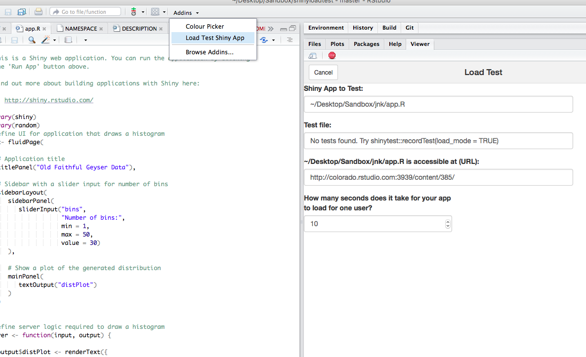

# shinyloadtest
[](https://travis-ci.org/rstudio/shinyloadtest)


This package extends the [shinytest package](https://github.com/rstudio/shinytest) to enable users to load test deployed Shiny applications. Load testing is executed using parallel phantomJS sessions.

## Installation

Currently, `shinyloadtest` is available on Github:

```r
devtools::install_github("rstudio/shinyloadtest")
```

You will also need to install `shinytest` and `phantomJS`. `shinytest` includes a helper function to install the latest version of `phantomJS`.

## Record Test

To get started, record a test using the `shinytest` package's recorder with `load_mode` enabled. The test should be reflective of expected application use. For more details, see the [`shinytest` documentation](https://rstudio.github.io/shinytest/). Tests must be recorded against a local copy of the deployed application.

```r
library(shinytest)
recordTest("path/to/app", load_mode = TRUE)
```


The recorder will save interactions with the application and timing information into a R file. In `load_mode` the recorded timing includes user pauses. This infomration is used to simulate a realistic user experience while load testing the application.

## Performing a Load Test

The easiest way to use the package is through the included addin. From within RStudio, navigate to the application file and then click `Load Test Shiny App` from the Addins menu.



The addin will walk through the parameters for defining a load test and will help pick useful defaults. Clicking `Run` will begin the load test. The load test includes running the application at load and a baseline test composed of a series of sequential tests, each executed 1 at a time. At the end of the load test an HTML report is created containing useful information about the result of the test. Detailed logs are also generated and written to the current working directory.

**WARNING** The load test can take a long time to run. The addin includes an estimate of the total test duration. The load test will generate multiple processes on the client machine. Use with caution. 


## [Example Report Output](https://beta.rstudioconnect.com/content/2612/addinTest.html)


## The `loadTest` function

The addin uses the `loadTest` function to run the load test.

```r
library(shinyloadtest)  
loadTest(testFile = 'myloadTest.R',
         url = 'https://beta.rstudioconnect.com/content/2551',
         numConcurrent = 8,
         numTotal = 16,
         loadTimeout = 5,
         stagger = 4, 
         phantomTimeout = 20)
```

This function uses the `parallel` and `foreach` packages to open concurrent R processes. Each R process uses phantomJS to run the recorded test against the deployed application.

`numConcurrent` is the number of concurrent connections to the application.

`numTotal` is the total number of tests run against the application.

`loadTimeout` is the maximum amount of seconds to wait for the Shiny app to load.

`stagger` adds a random delay of up to `stagger` seconds to the concurrent connections. 

`phantomTimeout` is the maximum seconds to wait for the phantomJS process to start.

**WARNING** Load testing a large number of concurrent connections will open a large number of processes on the client computer. Use with caution.

The `loadTest` function returns an event log that contains timing and event information for each visit to the application. The package includes functions for analyzing the event log such as `getSuccesses`, `getErrors`, `getMaxConcurrent`, `getPageLoadTimes`, and others. 

## Use Cases

`shinyloadtest` is best suited for testing applications with 20-60 concurrent connections. Driving more load on the deployed appliction is possible, but may require a server to act as the client. 

We recommend using `shinyloadtest` to experiment with application performance and tuning. For more details see: [Performance Tuning for Shiny Server Pro](https://support.rstudio.com/hc/en-us/articles/220546267-Scaling-and-Performance-Tuning-Applications-in-Shiny-Server-Pro), [Performance Tuning for RStudio Connect](https://support.rstudio.com/hc/en-us/articles/231874748), and [Performance Tuning for shinyapps.io](http://shiny.rstudio.com/articles/scaling-and-tuning.html).


