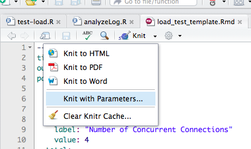

# shinyloadtest
[](https://travis-ci.org/rstudio/shinyloadtest)


This package extends the [shinytest package](https://github.com/rstudio/shinytest) to enable users to load test deployed Shiny applications. Load testing is executed using parallel phantomJS sessions.

## Installation

Currently, `shinyloadtest` is available on Github:

```r
devtools::install_github("rstudio/shinyloadtest")
```

You will also need to install `shinytest` and `phantomJS`. `shinytest` includes a helper function to install the latest version of `phantomJS`.


## Record Test

To get started, record a test using the `shinytest` package's recorder with `load_mode` enabled. The test should be reflective of expected application use. For more details, see the [`shinytest` documentation](https://rstudio.github.io/shinytest/). Tests must be recorded against a local copy of the deployed application.

```r
library(shinytest)
recordTest("path/to/app", load_mode = TRUE)
```


The recorder will save interactions with the application and timing information into a R file. For example, the following script is a test script for the [superzip application](http://shiny.rstudio.com/gallery/superzip-example.html).

```r
app <- ShinyLoadDriver$new()
app$snapshotInit("myloadtest")

app$setInputs(size = "college")
Sys.sleep(3.1)
app$setInputs(threshold = 6)
Sys.sleep(0.5)
app$setInputs(threshold = 7)
Sys.sleep(1.4)
app$setInputs(threshold = 8)
Sys.sleep(0.0)
app$setInputs(threshold = 7)
Sys.sleep(8.4)
app$setInputs(nav = "Data explorer")
Sys.sleep(0.4)
app$setInputs(states = "CO")
Sys.sleep(1.5)


app$snapshot()
app$stop()
app$getEventLog()

```

The key components of the test script that are unique to `load_mode` are the lines:

```r
app <- ShinyLoadDriver$new() # instructs the load test to use a LoadDriver

Sys.sleep()                  # records user pauses between inputs

app$snapshot()               # takes a screenshot of the application
app$stop()                   # disconnects from the application
app$getEventLog()            # returns the event log with timing information
```

## Running Load Tests

One way to run a load test against the deployed application is to use the `loadTest` function.

```r
library(shinyloadtest)  
loadTest(testFile = 'myloadTest.R',
         url = 'https://beta.rstudioconnect.com/content/2551',
         numConcurrent = 8,
         numTotal = 16,
         loadTimeout = 5,
         stagger = 4, 
         phantomTimeout = 20)
```

This function uses the `parallel` and `foreach` packages to open concurrent R processes. Each R process uses phantomJS to run the recorded test against the deployed application.

`numConcurrent` is the number of concurrent connections to the application.

`numTotal` is the total number of tests run against the application.

`loadTimeout` is the maximum amount of seconds to wait for the Shiny app to load.

`stagger` adds a random delay of up to `stagger` seconds to the concurrent connections. 

`phantomTimeout` is the maximum seconds to wait for the phantomJS process to start.

**WARNING** Load testing a large number of concurrent connections will open a large number of processes on the client computer. Use with caution.

The `loadTest` function returns an event log that contains timing and event information for each visit to the application.


## Running Load Test Reports

The package includes a R Markdown report. The report is located at:

```r
path.expand(paste0(path.package("shinyloadtest"), "/loadTestReport/load_test_template.Rmd"))
```
The report is parameterized. To run the report, open the report and then select `Knit with Parameters` from within RStudio:



You will be prompted to enter the parameters for your load test:


**WARNING** This report can take a long time to render and will generate multiple processes on the client machine. Use with caution. In addition to running the load test, this report will sequentially run a baseline test. This baseline test runs the test script in sequence and can take time if each individual test is lengthy.

An alternatvie approach is to update the parameters in the YAML, change the output format to `html_notebook`, and to interactively run each code chunk. Once done, you can preview the notebook which generates an html report from the interactively run code, wihout compiling the report all at once.

For an example report, run:

```r
setwd(path.expand(paste0(path.package("shinyloadtest"),"/loadTestReport/")))
rmarkdown::render("load_test_template.Rmd")
```

which should generate a [report like this](https://beta.rstudioconnect.com/content/2554/load_test_template.html).

## Use Cases

`shinyloadtest` is best suited for testing applications with 20-60 concurrent connections. Driving more load on the deployed appliction is possible, but may require a server to act as the client. 

We recommend using `shinyloadtest` to experiment with application performance and tuning. For more details see: [Performance Tuning for Shiny Server Pro](https://support.rstudio.com/hc/en-us/articles/220546267-Scaling-and-Performance-Tuning-Applications-in-Shiny-Server-Pro), [Performance Tuning for RStudio Connect](https://support.rstudio.com/hc/en-us/articles/231874748), and [Performance Tuning for shinyapps.io](http://shiny.rstudio.com/articles/scaling-and-tuning.html).


