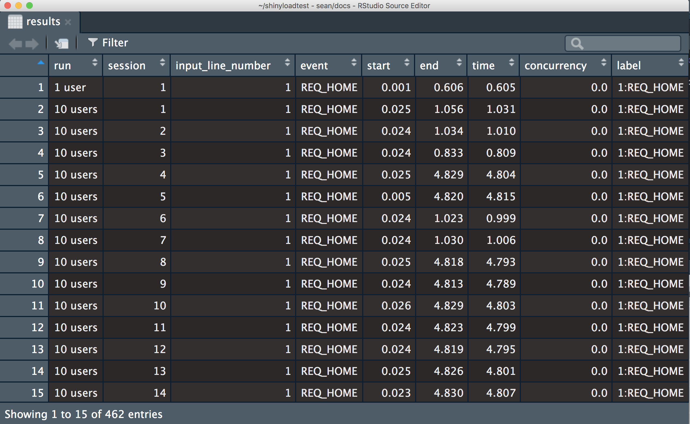
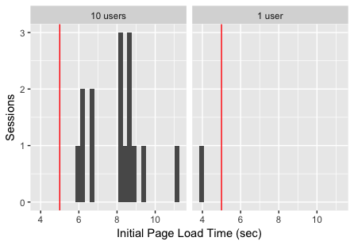

<!-- -*- mode: markdown; -*- -->

# Load Testing Shiny Applications

> This is a WIP, do not use yet. Please follow [community.rstudio.com][community] for a
soft launch of the tools.

The `shinyloadtest` package and the accompanying [`shinycannon`][shinycannon] software enable load testing
deployed Shiny applications.

Load testing helps developers and administrators estimate how many users their application can support. If an application requires tuning, load testing and load test result analysis can be used to identify performance bottlenecks and to guide changes to infrastructure, configuration, or code.

It's a common misconception that "Shiny doesn't scale." In actuality, properly-architected Shiny applications can be scaled horizontally, a fact which Sean Lopp was recently able to demonstrate at rstudio::conf 2018. We used `shinycannon` to simulate 10,000 concurrent users interacting with an application deployed to AWS. You can see a recording of Sean's talk and the load test demonstration here: [Scaling Shiny](https://www.rstudio.com/resources/videos/scaling-shiny/)

To get started with `shinyloadtest` read through the quick start guide below.

Additional (forthcoming) resources include:

* `shinyloadtest`'s log formats
* Case Study: How to interpret load test results
* How-to: Load test authenticated apps
* How-to: Use `shinyloadtest` to determine runtime settings in RStudio Connect or Shiny Server Pro

## Installation

To perform a load test you'll need two pieces of software: `shinyloadtest` and `shinycannon`.

* `shinyloadtest` is an R package used to generate recordings and analyze results. You should install it on your development machine.
* `shinycannon` is the command-line replay tool. You can install it on your development machine for testing, but for best results we recommend installing it on a server, and preferably not the one the application under test is also on.

### `shinyloadtest`

```R
devtools::install_github('rstudio/shinyloadtest')
```

### `shinycannon`

As opposed to the `shinyloadtest` R package, `shinycannnon` is installed and run differently depending on platform.

#### Linux

On many GNU/Linux distributions, `shinycannon` can be installed using a package:

Platform | Download URL | Install Command
-- | -- | --
Ubuntu/Debian | [shinycannon_1.0.0-22cb125_amd64.deb][shinycannon_deb] | `sudo dpkg -i shinycannon_1.0.0-22cb125_amd64.deb`
Redhat/Fedora/CentOS | [shinycannon_1.0.0-22cb125.x86_64.rpm][shinycannon_rpm] | `sudo yum install -y shinycannon_1.0.0-22cb125.x86_64.rpm`

#### macOS

1. Install [Java](https://www.java.com/en/download/)
1. Download [shinycannon-1.0.0-22cb125.sh][shinycannon_sh]
1. Install with `sudo cp shinycannon-1.0.0-22cb125.sh /usr/local/bin/shinycannon; sudo chmod +x /usr/local/bin/shinycannon`

#### Windows

1. Install [Java](https://www.java.com/en/download/)
1. Download [shinycannon-1.0.0-22cb125.jar][shinycannon_jar] to the directory you wish to run it in
1. Run with `java -jar shinycannon-1.0.0-22cb125.jar`

## Quick Start

The process for load testing a Shiny application consists of three steps:

1. **Record** a typical user session for the app
1. **Replay** the session in parallel, simulating many simultaneous users accessing the app
1. **Analyze** the results of the load test and determine if the app performed well enough

Rinse and repeat as necessary. Each step is described below.

### Step 1: Recording

Record a session using the `recordSession` function, which takes the URL of the **deployed** application:


```r
shinyloadtest::record_session('https://beta.rstudioconnect.com/content/3239/')
```

Running the function will open a browser displaying the app. Once open, interact with the application as a normal user would and then close the browser. After closing the browser, a file will be created that contains a recording of the session. This recording, written to `recording.log` by default, will serve as the basis for the load test.


### Step 2: Run the Load Test

With the recording in hand, we're ready to run the load test. The actual test is conducted outside of R using the stand alone `shinycannon` tool.

`shinycannon` can be used from the command line. An easy option is to use `shinycannon` from the RStudio terminal. The main arguments to `shinycannon` are:

- **sessions**: The number of concurrent users to simulate. `shinycannon` uses separate parallel threads to represent each user.

- **loaded-duration-minutes**: The duration of the load test. `shinycannon` will re-run the recording as necessary to meet the specified duration. For example, if the recording is 5 minutes long, but the desired test duration is 18 minutes, `shinycannon` will

As an example, to run a load test simulating 100 concurrent users for 20 minutes:

```bash
shinycannon recording.log https://beta.rstudioconnect.com/content/3239/ --sessions=100 --loaded-duration-minutes=20s

Logging at INFO level to output_dir/detail.log
2018-06-15T11:22:29.465037Z - Running: 0, Failed: 0, Done: 0
2018-06-15T11:22:29.466399Z - Worker thread 1 warming up
2018-06-15T11:22:29.476858Z - Worker thread 2 warming up
2018-06-15T11:22:29.477245Z - Worker thread 3 warming up
                           ...
2018-06-15T11:22:29.499708Z - Waiting for warmup to complete
                           ...
2018-06-15T11:22:29.516885Z - Maintaining for 20 minutes
2018-06-15T11:28:34.465847Z - Running: 100, Failed: 0, Done: 0
                           ...
2018-06-15T11:44:29.517080Z - Stopped maintaining, waiting for workers to stop
2018-06-15T11:48:34.465847Z - Running: 60, Failed: 0, Done: 40
                           ...
```

`shinycannon` includes detailed help documentation explaining the other arguments:

```bash
shinycannon --help
```

During the test, `shinycannon` reports the progress and number of simulated users. The result of the test is an output directory which includes timing information for each session.

### Step 3: Analyze the Results

The output directory created in step 2 is the focus of step 3. The `shinyloadtest` R package provides
functions for analyzing the output files from the test.

```r
library(shinyloadtest)
results <- tidy_loadtest(
      `20 users` = 'load-test-results',
      `1 user` = 'baseline-results'
)
results
```



```r
results %>%
   hist_loadtimes()
results %>%
   plot_time_boxplot()
```




Load the results into a shiny flex dashboard
```r
results %>%
  make_report() %>%
  rmarkdown::run()
```

[community]: https://community.rstudio.com
[shinycannon]: https://github.com/rstudio/shinycannon
[shinycannon_deb]:	https://s2.amazonaws.com/rstudio-shinycannon-build/2018-08-16-15:45:30_1.0.0-22cb125/deb/shinycannon_1.0.0-22cb125_amd64.deb
[shinycannon_rpm]:	https://s3.amazonaws.com/rstudio-shinycannon-build/2018-08-16-15:45:30_1.0.0-22cb125/rpm/shinycannon-1.0.0-22cb125.x86_64.rpm
[shinycannon_jar]:	https://s3.amazonaws.com/rstudio-shinycannon-build/2018-08-16-15:45:30_1.0.0-22cb125/jar/shinycannon-1.0.0-22cb125.jar
[shinycannon_sh]:	https://s3.amazonaws.com/rstudio-shinycannon-build/2018-08-16-15:45:30_1.0.0-22cb125/bin/shinycannon-1.0.0-22cb125.sh
