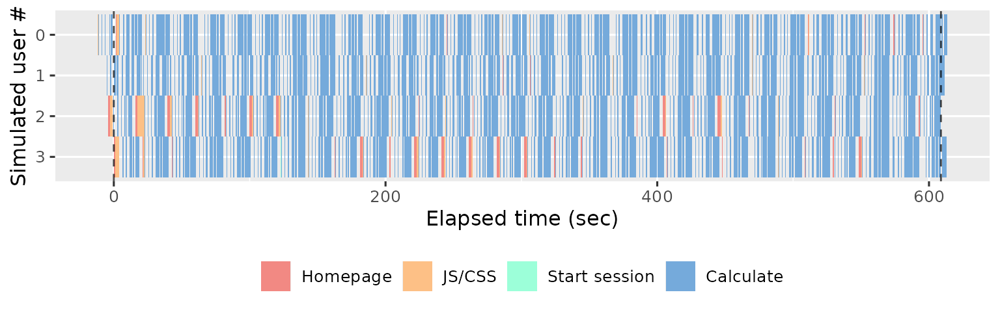
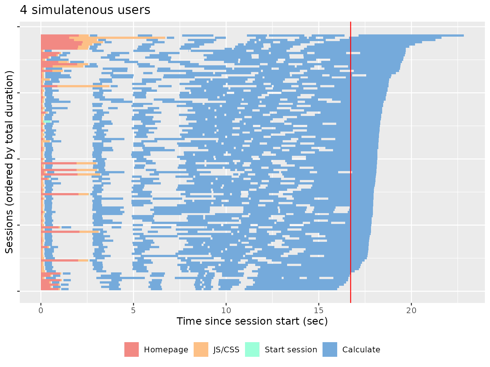
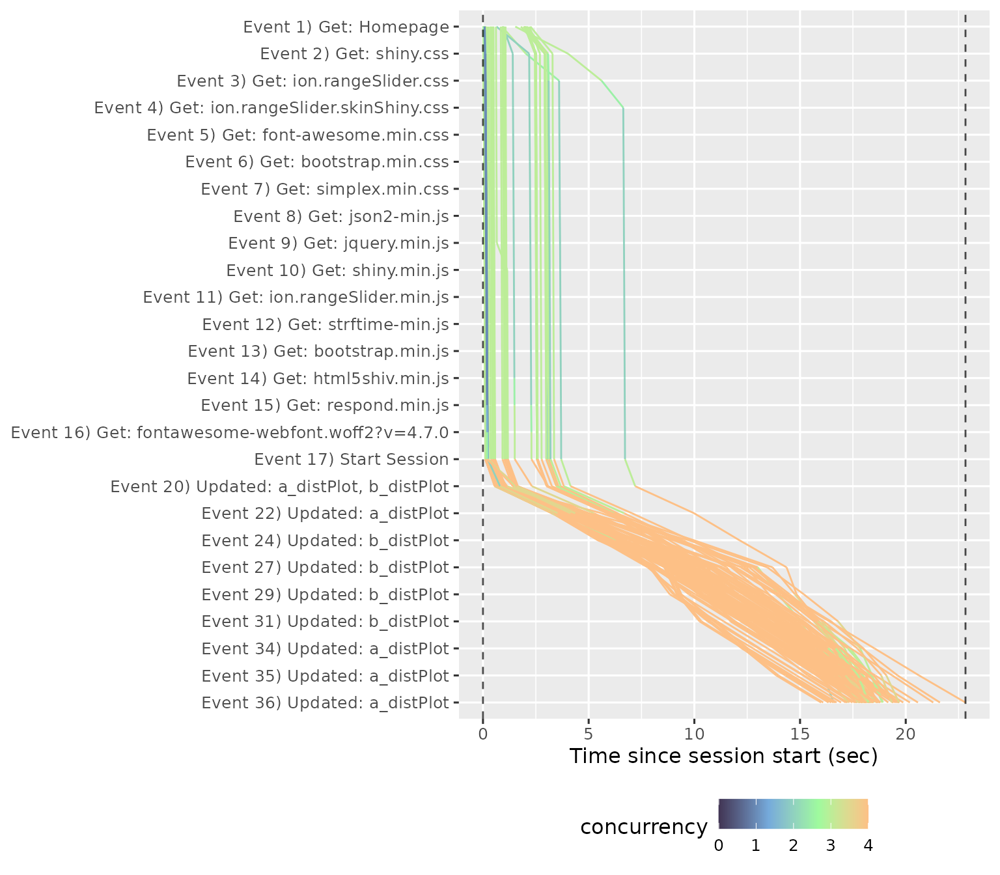
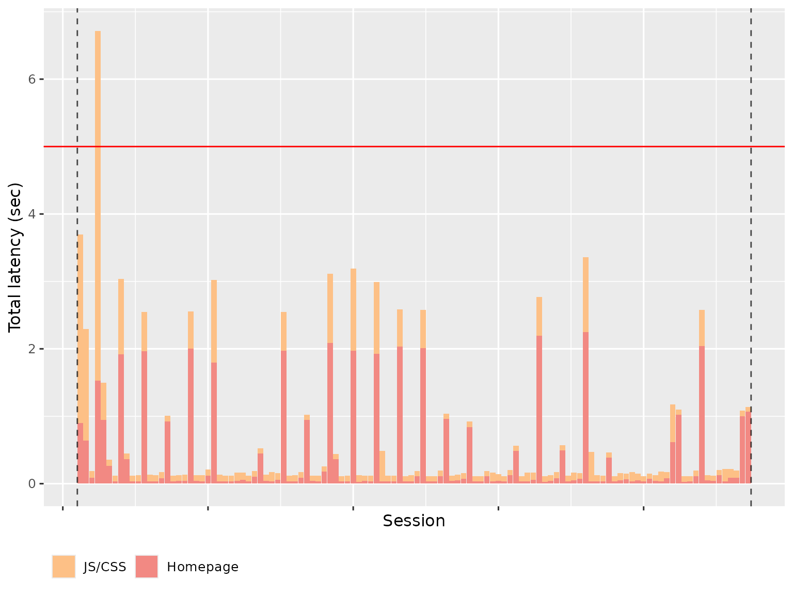
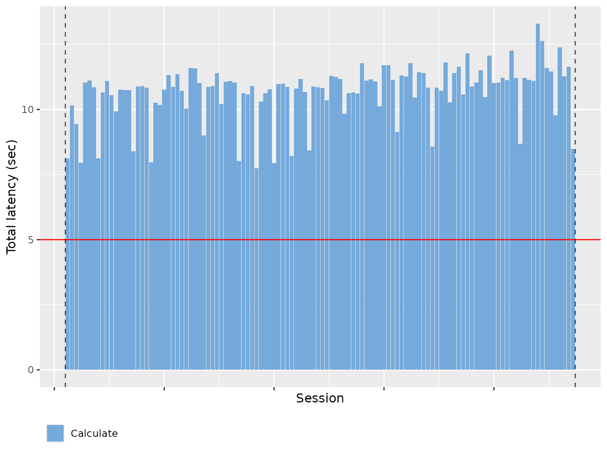
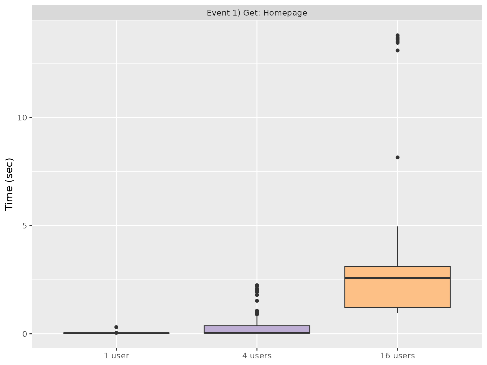
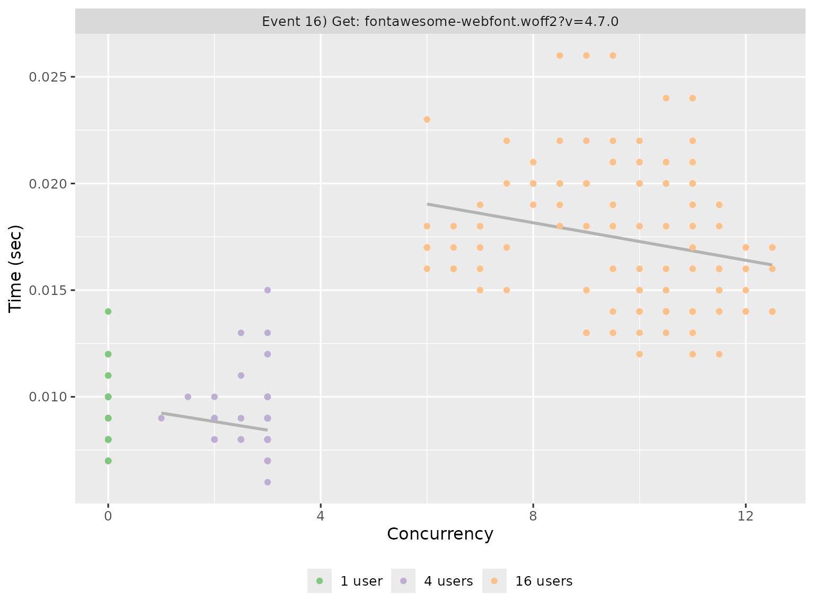

# Analyzing results

This vignette shows you how to analyse the results of your load tests,
explaining the plots produced in the report, and giving a few tips on
interpretation.

``` r

library(shinyloadtest)
library(dplyr)
```

## Loading data

Start by loading the `shinycannon` results into R with
[`load_runs()`](https://rstudio.github.io/shinyloadtest/reference/load_runs.md).
If you have a single run, just give it the directory of the results:

``` r

df <- load_runs("test_sessions/demo1")
```

If you have multiple runs, give it multiple directories, optionally
providing informative labels. Here I’m loading three runs that replay
the same script simulating 1, 4, and 16 simultaneous uses:

``` r

df <- load_runs(
  `1 user` = "test_sessions/demo1",
  `4 users` = "test_sessions/demo4",
  `16 users` = "test_sessions/demo16"
)
```

[`load_runs()`](https://rstudio.github.io/shinyloadtest/reference/load_runs.md)
returns a tidy tibble:

``` r

df
#> # A tibble: 11,729 × 13
#>    run    user_id session_id iteration input_line_number event    start
#>    <ord>    <int>      <int>     <int>             <int> <chr>    <dbl>
#>  1 1 user       0          0         0                 1 REQ_HOME 0    
#>  2 1 user       0          0         0                 2 REQ_GET  0.309
#>  3 1 user       0          0         0                 3 REQ_GET  0.316
#>  4 1 user       0          0         0                 4 REQ_GET  0.323
#>  5 1 user       0          0         0                 5 REQ_GET  0.33 
#>  6 1 user       0          0         0                 6 REQ_GET  0.339
#>  7 1 user       0          0         0                 7 REQ_GET  0.351
#>  8 1 user       0          0         0                 8 REQ_GET  0.361
#>  9 1 user       0          0         0                 9 REQ_GET  0.366
#> 10 1 user       0          0         0                10 REQ_GET  0.373
#> # ℹ 11,719 more rows
#> # ℹ 6 more variables: end <dbl>, time <dbl>, concurrency <dbl>,
#> #   maintenance <lgl>, label <ord>, json <list>
```

The first three variables identify each simulated session:

- `run` labels each shinycannon run.
- `user_id` labels each simulated user (shinycannon worker) within a
  run.
- `session_id` uniquely identifies each simulated session (script
  replay) within a run.

[`?load_runs`](https://rstudio.github.io/shinyloadtest/reference/load_runs.md)
provides a full description of all the variables.

## Report output

You won’t generally work with this data directly — instead, you’ll
usually start by creating a standalone HTML report:

``` r

shinyloadtest_report(df, "report.html")
```

This report contains six pages of diagnostic information: sessions,
session duration, event waterfall, latency, event duration, and event
concurrency. I describe each page below.

## Sessions

The **Sessions** page displays the summarises the simulated sessions
performed by each shinycannon worker. Each row represent one worker and
each rectangle represents one event. The width of the rectangle gives
the duration of the event, and the colour gives the event type. For
example, the following plot shows the actions performed by 4 workers
over 5 minutes (600s):



If you use more workers, you’ll see more rows. The following plot shows
the results from 16 simultaneous workers:


The first thing to look for in this plot is the balance between the user
waiting for the app (coloured rectangles) and the app waiting for the
user (gray background shows through). The more brightly coloured the
plot, the more time that the user spends waiting. The precise colour of
the block is also informative, as there are five types of action that
proceed in roughly the same order in every session:

- Homepage (red): the browser first loads the HTML homepage generated by
  your `ui`, representing the start of a new simulated session. If the
  first session takes a long time to load, you’re probably doing too
  much work on start up (but you’ll have also noticed this when starting
  the app yourself). If subsequent sessions take a long time, you
  probably have a `ui()` function that is doing too much work.

- JS/CSS (orange): once the browser has read the homepage, it next
  requests the `.css` and `.js` files needed to render the page. It is
  very rare for these to take a long time, and typically if they do it’s
  because the server is “blocked” waiting for computation requested by
  another worker.

- Start session (green): now the browser creates a bi-direction line of
  communication to the Shiny session using [SockJS](http://sockjs.org).
  The browser uses this to notify Shiny when the user interacts with an
  input, and Shiny uses it to tell the browser how to update the
  outputs.

- Calculate (blue): the user has changed an input and Shiny has
  performed computation to update an output or execute an observer.

- Waiting (uncoloured): the app is waiting for input; i.e. the user is
  thinking about what to do next.

Also note the dotted vertical lines. These show the three major phases
of the load test:

- Before the first dotted line, we have the **warmup** phase, where
  shinycannon gradually ramps up to the desired number of workers.

- Next we have the **maintenance** phase, where the number of sessions
  is held constant; whenever one replay completes, shinycannon restarts
  the script.

- Finally, after the second dotted line, we have the **cooldown** phase
  where the workers are shut down one at a time, until none are left the
  run is complete..

The rest of the report will focus on sessions in the maintenance phase
since these represent an app under the full load of simultaneous users.
If the maintenance period is a only a small proportion of the full app,
you’ll need to re-run the simulation with a greater
`--loaded-duration-minutes` value.

The sessions tab gives you an overview of the experimental design (how
sessions were assigned to workers), so you’ll generally only spend a
small amount of time on this page before moving on to the **session
duration**.

## Session duration

The **Session duration** page uses similar graphical conventions to the
**Session** page but instead of one worker per row, we now have one
session per row, and the time on the x-axis is relative to session
start. A red line shows the running time of the original script.



This plot shows us that most sessions are completed in about the same
amount of time as the original script, which suggests that the app can
comfortably handle four simultaneous users. We get a very different
picture if we look at the performance of the app with 16 simultaneous
users:


The fastest session now takes ~4 times longer than the original
recording, and there’s one session that takes twice again as long again.
This suggests that we’ve overloaded the server and we either need to
increase server resources or optimise the app.

## Event waterfall

The **Event Waterfall** gives a more precise view into the individual
events within a recording. Each line represents a session, with events
running from top to bottom, and elapsed time on the x-axis.



In this plot you’re primarily looking for uniform shape. In particular,
you want the lines to be parallel, because a crossing line indicates
that user A started before user B, but finished afterwards (this is like
seeing the table that ordered after you get their food first). We can
see this problem in different run, where a file was uploaded and many
POST requests were made.


## Latency

The **Latency** page summarises the amount of time spent waiting, broken
down in to total HTTP (homepage + js/css) and websockets (representing
calculation). The **Total HTTP** latency plot shows how long a user has
to wait before they see *something* in their browser. Ideally, this will
be very short since the server is just providing static files.



The variability is because R is single threaded; if Shiny is performing
a computation for another worker, it can’t launch the transmission of
static files.

The **Maximum WebSocket** latency shows how much time time a user spends
waiting for outputs to be updated. This basically represents how much
time R spends computing. To make this faster, you’ll need to make your R
code faster.



## Event duration

The **Event Duration** page helps understand the variability of
individual events. Each event is summarised with a boxplot, with run on
the x-axis and time on the y-axis:



Since there are typically many events, and most are uninteresting, the
report gives you three ways to find interesting events:

- Slowest maximum time.
- Slowest minimum time.
- Largest mean difference (only shown if more than one run being
  processed).

These plots can help you find events that are either slow, or have high
variability. You’ll then need to backtrack to the underlying Shiny code
and think about how to improve performance.

## Event concurrency

The **Event Concurrency** page helps you understand how events responded
to varying degrees of concurrent load. Each simulated session is
represented by a point with number of concurrent processes on the x-axis
and time taken on the y-axis. The points are coloured by run. Each run
also gets a line of best fit, which gives a sense for how the event
respond to increasing concurrency.



Like **Event Duration**, most events are uninteresting, so the report
gives you three ways of sorting to find interesting events:

- Largest slope, which emphasises events that appear to respond
  particularly poorly to increasing concurrency.
- Largest intercept
- Largest error

If you want your app to handle as many user as possible, look for events
where the time increases steeply with concurrency - these are places
where optimisation will have the greatest impact.
