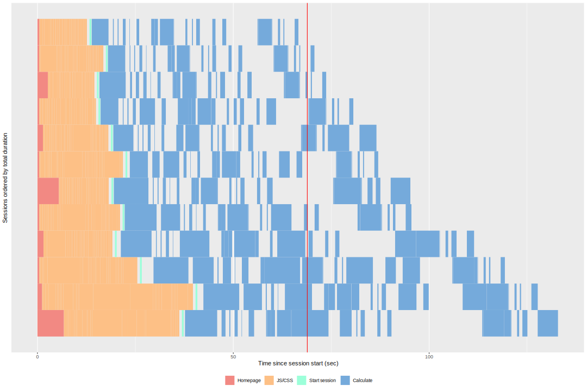

```{r setup, include = FALSE}
knitr::opts_chunk$set(
  collapse = TRUE,
  comment = "#>"
)
```

`shinyloadtest` and `shinycannon` are tools to help you assess your application's performance. Since they are only tools to measure performance and not to improve it, they must be used as part of a larger workflow.

In this case study, we'll introduce a workflow — *the optimization loop* — and apply the workflow to the process of optimizing the [cranwhales](https://github.com/rstudio/cranwhales) demo application.

For a lighter treatment of `shinyloadtest` that will get you using it faster, you may consider starting with [the introductory tutorial](..) instead.

## The Optimization Loop


The optimization loop is a general methodology for approaching optimization work. Applied to the problem of capacity optimization, which is the area `shinyloadtest` is helpful in, the steps are defined as:

1. **Benchmark**: Pick a number *n*, how many users your application must concurrently support. Simulate *n* users interacting with your application and collect latency metrics. Use `shinyloadtest::record_session` to record a realistic interaction, and the `shinycannon` tool to simulate *n* users performing the recorded interaction.
1. **Analyze**: Visualize and interpret the metrics. `shinyloadtest::load_runs` is used for this part. If it looks like *n* users can be supported, stop here. Otherwise, go to the next step.
1. **Recommend**: Based on analysis, propose a way for the capacity of the application to be increased. Patterns in the metrics can help you identify what change in the application or its configuration would be most beneficial. It could be a code change, like [converting the app to async](https://rstudio.github.io/promises/articles/casestudy.html), or a configuration change, like increasing the number of R processes allocated to the application in RStudio Connect or Shiny Server Pro.
1. **Optimize**: Implement one or more of the recommendations and benchmark again. Repeat the process until the application supports *n* users to your satisfaction.

## The cranwhales demo app

For the purposes of this case study, we'll pretend that [cranwhales](https://github.com/rstudio/cranwhales) is an app we wrote and that we're interested in ensuring it can support a minimum number of concurrent users. In a nutshell, cranwhales is a way to visualize anonymized download statistics from RStudio's `0-Cloud` CRAN mirror. For more on the app's features, see [the tour](https://rstudio.github.io/promises/articles/casestudy.html#a-tour-of-the-app).


cranwhales was written by [Joe Cheng](https://twitter.com/jcheng) to demonstrate Shiny's [async capabilities](https://blog.rstudio.com/2018/06/26/shiny-1-1-0/). We use it here because it's close to a typical Shiny app in size and scope, and because it's already given an optimization treatment in [Joe's async case study](https://rstudio.github.io/promises/articles/casestudy.html).

Joe's case study focuses on the **optimize** step and the mechanics of improving performance with an emphasis on using async to do so. Here, we'll instead focus on the **benchmark** and **analyze** steps as enabled by `shinyloadtest` and `shinycannon`.

## Deployment

cranwhales is currently [deployed on shinyapps.io](https://gallery.shinyapps.io/cranwhales/), but we'll assume for this case study that you've deployed cranwhales to your own [RStudio Connect](https://www.rstudio.com/products/connect/) instance with default runtime/scheduler settings. `shinyloadtest` is capable of benchmarking and generating load against apps that [require authentication](load-testing-authenticated-apps.Rmd) but we'll assume your deployment of cranwhales is accessible without authentication.

## Benchmark

The first step is benchmarking, and we'll do it in several sub-steps:

1. Record a realistic session using `shinyloadtest::record_session`
1. Run `shinycannon` with 1 user, producing a directory of "baseline" metric data
1. Pick a number **n**, the number of users we want to be able to use the app at the same time
1. Run `shinycannon` with **n** users, producing another directory of metric data

### Record a session

First you should install the `shinyloadtest` R package if you haven't yet:

```{r, eval = FALSE}
devtools::install_github("rstudio/shinyloadtest")
```

Next, obtain the "solo" URL of the deployed app in RStudio Connect. You can do this by navigating to the application from the list of published content, clicking the circular button at the top right of the screen, and then clicking "Open Solo". This will open a new window. Copy the URL from this new window.


Back in the R console, run `record_session` with the solo URL as an argument:

```{r, eval = FALSE}
library(shinyloadtest)
record_session("https://rsc.example.com/content/1234/")
```

This starts a local web server listening on `http://127.0.0.1:8600/` and should also open a new browser window to this URL. This local web server is a proxy that relays content to and from your RStudio Connect instance, recording interactions so that they can be played back later. It's in this window that you should model what you imagine would be a typical user interaction. Click around, change things, and observe new outputs.

Do this for 1-2 minutes. When you're done, close the browser tab. You should notice the function return in the R console.

On disk, in the directory where you started R, will be a new file: `recording.log`. There may also be other files like `recording.log.post.0`. These complementary files are created when you upload files or if you use an htmlwidget like [DT](https://github.com/rstudio/DT) that uses HTTP POST to send data.

Together, these files constitute a **recording**. They are the input to `shinycannon`.

### Baseline run

Now that you've made a recording, you're ready for your first `shinycannon` run. For the first run, you should just test with 1 user. This will generate metrics analogous to those you experienced when you made your recording, and will serve as a baseline for subsequent runs.

> Note: It's best to run shinycannon on a machine close to the target machine on the network. We don't want RStudio Connect and shinycannon to contend for resources on the same machine.

In the directory where your `recording.log*` files are, run `shinycannon` like this:

```
shinycannon recording.log https://rsc.example.com/content/1234/ --workers 1 --loaded-duration-minutes 5 --output-dir run1
```

- `recording.log` is the recording to use
- `https://rsc.example.com/content/1234/` is the "solo" URL of the target application
- `--workers 1` means to simulate one user
- `--loaded-duration-minutes 5` means each user should continually "loop" through the recording for at least 5 minutes after all workers have started. Since our recording is about a minute long, for this run we'll collect metrics for about 5 iterations of the recording.
- `--output-dir` is the directory to populate with metrics and run metadata.

> Note: The command to run shinycannon might be different on your platform. For alternatives, see the [shinycannon instructions](https://rstudio.github.io/shinyloadtest/index.html#shinycannon)

Once `shinycannon` has started, you should see output like the following:

```
2018-08-31 00:22:11.009 INFO [progress] - Running: 0, Failed: 0, Done: 0
2018-08-31 00:22:11.010 INFO [thread00] - Waiting for warmup to complete
2018-08-31 00:22:11.011 INFO [thread01] - Warming up
2018-08-31 00:22:11.011 INFO [thread00] - Maintaining for 5 minutes (300000 ms)
2018-08-31 00:22:16.010 INFO [progress] - Running: 1, Failed: 0, Done: 0
2018-08-31 00:22:21.011 INFO [progress] - Running: 1, Failed: 0, Done: 0
```

- Messages labeled `[progress]` are status messages printed every 5 seconds until the run is complete.
- Messages labeled `[thread00]` are produced by the parent thread supervising the run, and contain information about state transitions. A run moves through 3 states as it progresses: warming up, maintaining, and cooling down. The warmup and cooldown periods are those during which workers are gradually starting or stopping. Maintenance is the period during which all workers are running, and its length is governed by the `--loaded-duration-minutes` option.

> Note: If you see any messages of severity ERROR, the run hasn't necessarily failed, but the metrics it produces may not be usable. You should investigate the error and re-run. The `--debug` flag will result in the creation of a `debug.log` file in the output directory, which may be useful for debugging but can become large quickly.

### Comparison run

Now that we have baseline metrics, we should conduct a more ambitious run for contrast. Perhaps in our organization we can expect up to 5 people to use cranwhales at the same time, so to simulate that possibility we'll run `shinycannon` again with `--workers 5`:

> Load testing can be useful even if your target number is small, like 5.


```
shinycannon recording.log https://rsc.example.com/content/1234/ --workers 5 --loaded-duration-minutes 5 --output-dir run5
```

## Analyze

At this point we have two runs worth of metrics in our `run1` and `run5` output directories. Let's get back in an R console and process the data into a dataframe:

```{r, eval = FALSE}
library(shinyloadtest)
df <- load_runs("Run 1" = "run1", "Run 5" = "run5")
```

With the data in a tidy data frame, we can generate an HTML report:

```{r, eval = FALSE}
shinyloadtest_report(df, "report1.html")
```

When you open `report1.html` in your browser, you'll see something like this:


> If you don't want to generate the report yourself, you can view an example here: [case_study_report1.html](https://rstudio.github.io/shinyloadtest/articles/case_studies/case_study_report1.html)

There's a lot to take in here. If you're interested in the meaning of everything you see, check out the [analyzing load test logs vignette](analyzing-load-test-logs.html).

For now, let's focus on the "Session Duration" tab. You'll notice a tab bar at the top of the page that lets you quickly toggle between the Run 1 and Run 2 session durations. Here they are:




In each plot, time is the X axis and sessions are stacked atop one another on the Y axis.

On the first plot, we see 4 sessions, and each one completes roughly around the red line. The red line denotes the length of the recording. So, in the 1 worker run, the sessions seem to take roughly as long as they did for us to record. That indicates to us that the experience of using the application for these 4 sessions was similar to the one we experienced making the recording.

On the second plot, we see 12 sessions stacked, and the slowest one took roughly twice as long to play than it did for us to record. Many others also took significantly longer. This indicates to us a significant decrease in the responsiveness of the application as the number of concurrent users increases.

> `--workers 1` resulted in 4 sessions, and `--workers 5` resulted in 12 sessions. Why is that? It's because each worker repeated the recording as many times as it could in 5 minutes. So, the relationship between workers and sessions is one to many.

If your target number **n** is very large, you may find it easier to start by looking at the Latency tab which shows histograms of latency for the page load time and the latency of user interactions with the app.

## Recommend

The application doesn't seem to have performed well with 5 concurrent users, but it's important to keep in mind that performance is relative to the kind of application you're optimizing and to the needs of your users. If we do decide the app is too slow and we want to try to improve it, there are two courses of action we can consider:

1. We could [tune the app's RStudio Connect configuration](https://support.rstudio.com/hc/en-us/articles/231874748-Scaling-and-Performance-Tuning-in-RStudio-Connect). In this case, the easiest way to improve the performance in the 5-user case is to modify the app's scheduler settings, dedicating 1 process per user and limiting the number of processes to 5.
1. We could improve the performance of the application at the code level.

Dedicating more resources to the app is the easiest way to improve its performance, but it's also the most costly resource-wise, and depending on what's slow, might not even help. Dedicating your developer time is potentially costly in terms of your time, but improves the scalability of your app in the long run.

Throwing hardware at the problem is an easy fix in our case, but there's usually a strong chance that it's really easy to make your app dramatically faster with only small code changes. For example, you might just need to do some work once when your app starts instead of every time a reactive changes. Here are some resources for learning more about Shiny app performance:

1. `profvis`: In [this webinar](https://www.rstudio.com/resources/webinars/profvis-profiling-tools-for-faster-r-code/), Winston Chang demonstrates using the profvis package to efficiently identify and improve slow paths in code.
1. In [this rstudio::conf talk](https://resources.rstudio.com/rstudio-conf-2018/make-shiny-fast-by-doing-as-little-work-as-possible-alan-dipert), Alan Dipert describes the Shiny team's efforts to improve the scalability of another demo app, CRAN explorer.
1. In [this other rstudio::conf talk](https://resources.rstudio.com/rstudio-conf-2018/scaling-shiny-apps-with-async-programming-joe-cheng), Joe Cheng describes how async can be used to improve the scalability of Shiny apps.

For the purposes of this case study, let's say that we're really busy, and it makes sense for us to just crank up the scheduler settings now, and investigate the code later.

## Optimize

In the "Runtime" tab of the application's settings in RStudio Connect, let's "Specify custom settings":

- Max processes: 5
- Min processes: 1
- Max connections per process: 1
- Load factor: 0.00

With these settings, our hypothesis is that each user will be assigned their own R process, and the metrics should look closer to the baseline than our previous `run5`

## Benchmark again

Let's run `shinycannon` again, and output results to a different directory, `run5-new-settings`:

```
shinycannon recording.log https://rsc.example.com/content/1234/ --workers 5 --loaded-duration-minutes 5 --output-dir run5-new-settings
```

## Analyze again

Now, back in R, we can generate a new report and compare `run5` to `run5-new-settings`:

```{r, eval = FALSE}
library(shinyloadtest)
df <- load_runs("Run 5" = "run5", "Run 5 new" = "run5-new-settings")
shinyloadtest_report(df, "report2.html")
```

> If you don't want to generate the report yourself, you can view an example here: [case_study_report2.html](https://rstudio.github.io/shinyloadtest/articles/case_studies/case_study_report2.html)


Just as we hoped, performance is much improved. After adding processes, sessions didn't take as long to run. Because they didn't take as long to run, more of them were able to complete in our 5-minute maintenance period.

# Conclusion

In this case study we introduced *the optimization loop* workflow and demonstrated how `shinyloadtest` and `shinycannon` can be used together to assess an application's performance and guide its optimization.

We ran a baseline test to establish the performance of our application in the single-user case, and then ran a subsequent test to see how it did with multiple concurrent users.

We were dissatisfied with its multi-user performance, and considered whether to improve the application's performance or simply allocate it more resources. We chose to allocate more resources. Then we benchmarked and analyzed again and observed a satisfactory improvement.

If in the future our application needed to support many more users, we could apply this process again. We might decide next time to invest in the performance of the code instead of just tweaking configuration.
