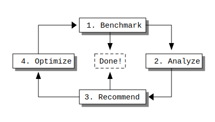

```{r setup, include = FALSE}
knitr::opts_chunk$set(
  collapse = TRUE,
  comment = "#>"
)
```

`shinyloadtest` and `shinycannon` are tools to help you assess your application's performance. Since they are only tools to measure performance and not to increase it, they must be used as part of a larger workflow.

In this case study, we'll introduce a workflow — *the optimization loop* — and guide you through a series of measurements and optimizations with a demo application, [cranwhales][cranwhales].

For a lighter treatment of `shinyloadtest` that will get you using it faster, you may consider the [the introductory tutorial](..) instead.

## The Optimization Loop




[cranwhales]: https://github.com/rstudio/cranwhales
