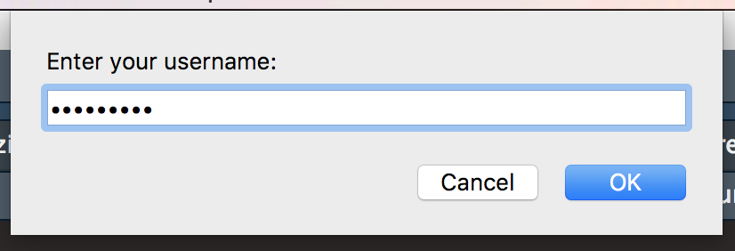

```{r setup, include = FALSE}
knitr::opts_chunk$set(
  collapse = TRUE,
  comment = "#>"
)
```


`shinyloadtest` includes support for recording and load testing applications that require authentication. 

## Recording:

To record against an application that requires authentication, use the same `record_session` function:

```
shinyloadtest::record_session('https://beta.rstudioconnect.com/content/3239/')
```

During recording, a prompt will appear asking for the username and password for the application:



The credentials are passed securely to the deployed application, and are not recorded in the recording log file. An important place holder is created in the recording log file. The place holder will be used by `shinycannon` during the load test.

## Load Test 

To run the load test, use the same `shinycannon` commands. `shinycannon` will require that the credentials for the application are available in the environment variables: `SHINYCANNON_USER` and `SHINYCANNON_PASS`.

For example:

```bash
export SHINYCANNON_USER='username'
export SHINYCANNON_PASS='super-secret-pwd'

shinycannon recording.log https://beta.rstudioconnect.com/content/3239/ --sessions=50 --loaded-duration-minutes=30
```


## Limitations

There are two main limitations to load testing applications that require authentication.

First, the load testing tool only supports authentication forms that accept a username and password directly. We've tested `shinyloadtest` and `shinycannon` with:

- RStudio Connect and Shiny Server Pro using AD / LDAP
- RStudio Connect and Shiny Server Pro using Built-in Authentication
- RStudio Connect and Shiny Server Pro using PAM

RStudio Connect and Shiny Server Pro using oAuth, Proxied Auth, or other SSO tools are NOT supported.

Second, the load testing tool will run every simulated user under the same credentials. For most applications this is not a concern. However, both Shiny Server Pro and RStudio Connect support a class of Shiny applications that behave differently  based on the logged in user (available in `session$user`). By default, a load test will only be able to test a single "behavior path" at a time. To test multiple behaviors at once, create multiple recordings for different users and manually run multiple load tests at the same time.
